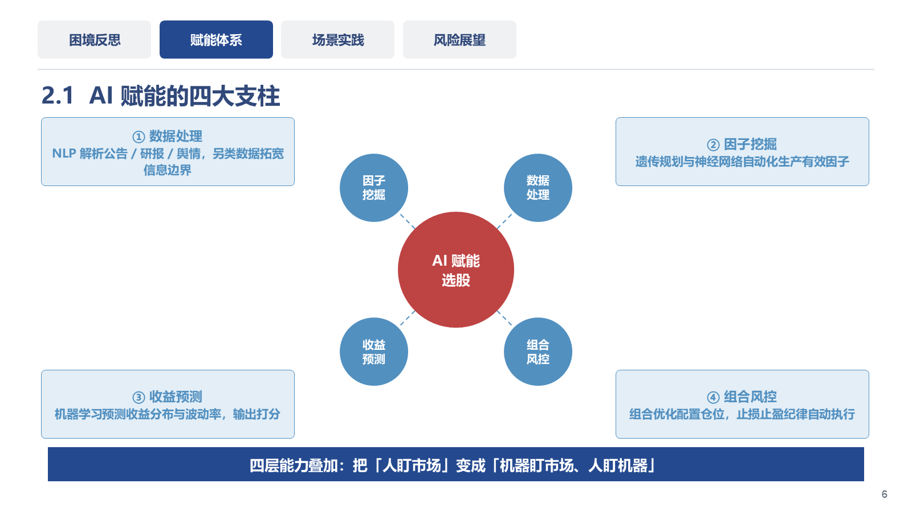
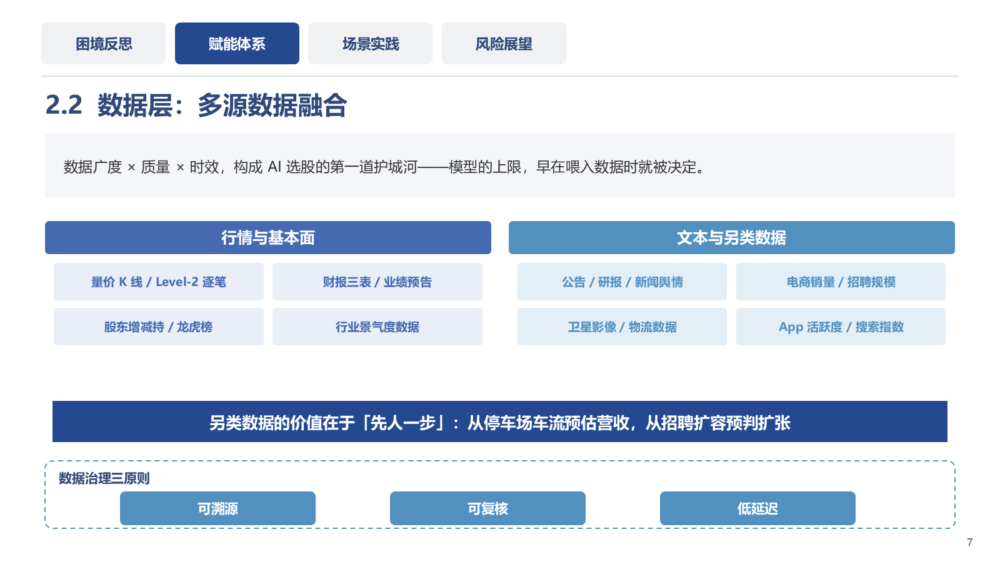
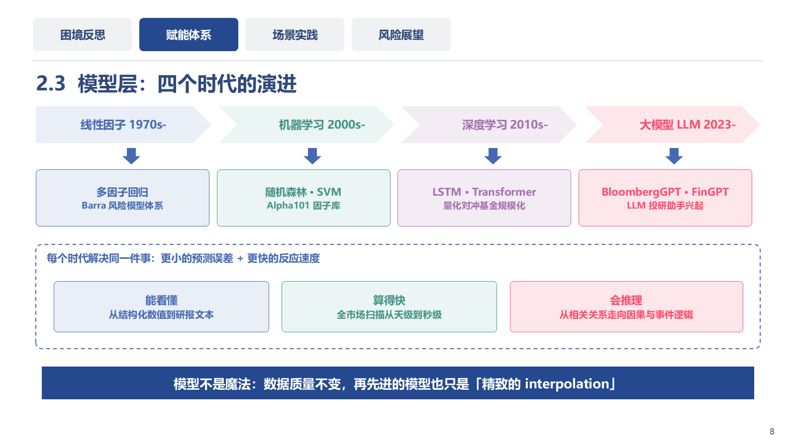

# blue-academic-ppt · 蓝白学术风 PPT 技能包

一个 [ZCode](https://zcode.ai) / Agent Skills 标准技能包：把个人「蓝白学术风」PPT 设计系统沉淀为可复用的组件库，让 AI 用统一的风格生成可直接使用的 .pptx。三变体：**答辩风 defense**（开题/答辩/学术汇报）、**商务风 business**（项目/产品汇报）、**竞赛路演风 contest**（服务外包/互联网+/挑战杯等大赛）。

## 两种工作模式

| | 模式 A · 重画 | 模式 B · 模板克隆 |
|---|---|---|
| 原理 | 参数化组件库按内容重画 | XML 层克隆原版页面、只替换文字 |
| 保真度 | 风格复刻 ~90-95% | **与原版 100% 一致** |
| 自由度 | 任意新内容 / 新构图 / 页数 | 受限于模板已有版式 |
| 适用 | 新课题、新结构 | 同类汇报换内容 |

## 效果预览

以下页面全部由组件库代码生成（模式 A 重画，未使用任何模板文件），可直接编辑：

<p float="left">
  
  
  
</p>

*左：中心辐射图（hub-spokes）· 中：徽章矩阵（badge-grid）· 右：chevron 流程链 —— 均为原生形状绘制，PowerPoint 内可逐元素编辑*

## 技能包内含

- **90+ 参数化组件**（`scripts/scaffold.js`）：答辩风内容页、图解页（矩阵/流程链/环形体系/双循环）、图解集整页（花瓣中心/圆柱链/波浪飘带）、竞选叙事页（照片封面/扇形目录/证书展台）、商务汇报页、竞赛路演页（痛点四联卡/需求三栏/技术五步/团队介绍/辐射中心）
- **配图生成族**：28 种 `glyph` 图标字形（圆柱/漏斗/齿轮/机器人/看板…预设几何拼成，line/fill 双模式）+ 连接件/迷你表/演示图形（散点、划分树、图标柱状图、分期折线、SQL 块、问答气泡、循环流程）——技术页与创新点页的小示意图**全部现场绘制**，不靠占位图
- **11 个色族**（蓝白学术 / 多色粉彩 / 珊瑚红钢蓝 / 竞选宝蓝金 / 竞赛亮蓝青绿），全部收敛为常量，杜绝配色漂移
- **30+ 构图骨架** + 设计规范（`references/style-guide.md`）：信息密度标准、行首禁则、孤字换行禁令、画图判定等硬规则
- **QA 流水线**：`fix_ppr.py`（富文本段落修复）→ `check.py`（溢出/越界/重叠检查）→ `render.ps1`（PowerPoint 渲染）→ 视觉验收
- **模板克隆引擎**（`scripts/clone_deck.py`）：预算内文字替换（原文 ×1.15）、嵌入字体子集处理（`--strip-fonts`）、多页克隆与删页

## 安装

```bash
# 1. 克隆到 ZCode/Agent Skills 的技能目录
git clone https://github.com/<you>/blue-academic-ppt.git \
  "$HOME/.agents/skills/blue-academic-ppt"

# 2. 安装依赖
npm install -g pptxgenjs          # 模式 A：重画
pip install python-pptx           # 模式 B：模板克隆

# 3. 重启你的 AI 编程工具，说「用我的风格做个开题答辩 PPT」即可触发
```

## 使用示例

```js
// 模式 A：组件重画
const S = require("<技能目录>/scripts/scaffold.js");
const pres = S.init({ variant: "defense", title: "开题报告" });
const s = pres.addSlide();
S.coverDefense(s, {
  title: "基于深度学习的软骨影像分割研究",
  info: [{ label: "答辩人", value: "张三" }, { label: "日期", value: "2026.09" }],
  summary: "恳请各位老师批评指正",
});
await pres.writeFile({ fileName: "out.pptx" });
```

```bash
# 模式 B：模板克隆（把你的 .pptx 模板放入 assets/templates/ 并登记 manifest.json）
python scripts/clone_deck.py assets/templates/shuobo.pptx out.pptx plan.json --strip-fonts
python scripts/check.py out.pptx
```

## 目录结构

```
blue-academic-ppt/
├── SKILL.md                      # 技能入口：工作流 + 硬规则（AI 自动读取）
├── references/style-guide.md     # 设计规范 + 全组件参数手册 + 构图骨架
├── scripts/
│   ├── scaffold.js               # 组件库（核心资产）
│   ├── clone_deck.py             # 模板克隆流水线
│   ├── check.py                  # 溢出/越界/重叠检查
│   ├── fix_ppr.py                # 富文本 pPr 修复
│   └── render.ps1                # PowerPoint 渲染（视觉质检用）
└── assets/
    ├── reference/                # 版式参考渲染图（对照校准用）
    └── templates/                # 克隆模板（版权素材不入库，自行放置）
```

## 模板版权说明

`assets/templates/` 下的 .pptx 模板为第三方版权素材，**不随本仓库分发**。请将你有权使用的模板放入该目录，并按 `manifest.json` 的格式登记。本仓库的代码与规范文档采用 MIT 许可（见 LICENSE）；参考渲染图仅供个人学习对照使用。

## 环境

- Windows + [Node.js](https://nodejs.org) LTS + Python 3.10+
- 模式 B 的渲染质检需要本机安装 Microsoft PowerPoint（没有也不影响生成）
